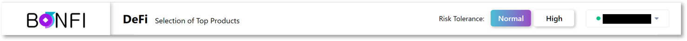

# Using the BonFi Platform

## Streamlining DeFi

Many DeFi solution are complicated and require a steep learning curve for users to get started. With this in mind, the BonFi Platform was designed to provide a streamlined experience on how users interact with DeFi products, the BonVest and the BonAI. 

The BonVest enables users to optimize their crypto portfolios according to their risk appetite and continuously works in the background. 

User have the option to select a Risk Tolerance level that will filter the BonVest's risk engine results accordingly.  

<table>
  <thead>
    <tr>
      <th style="text-align:left">Risk Tolerance</th>
      <th style="text-align:left">Description</th>
    </tr>
  </thead>
  <tbody>
    <tr>
      <td style="text-align:left">Normal</td>
      <td style="text-align:left">
        <ul>
          <li>Provides a basic overview of the DeFi market and available products</li>
          <li>Products are proven and core metrics indicate a normative risk exposure</li>
        </ul>
      </td>
    </tr>
    <tr>
      <td style="text-align:left">High</td>
      <td style="text-align:left">
        <ul>
          <li>Features a comprehensive overview of the DeFi market and available products</li>
          <li>Products highlighted indicate normative to high risk exposure</li>
          <li>Products are generating higher yields, however, are inherently of higher
            risk for users</li>
        </ul>
      </td>
    </tr>
  </tbody>
</table>

