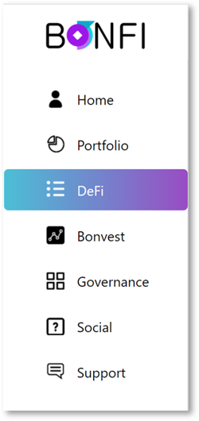

# Navigation

## BonFi Platform Index

The BonFi Platform is composed of various elements that combined provide a holistic overview of the DeFi market:

<table>
  <thead>
    <tr>
      <th style="text-align:left">Home</th>
    </tr>
  </thead>
  <tbody>
    <tr>
      <td style="text-align:left">
        
The main dashboard of the BonFi Platform, allowing for quick access to
          the following sections:

        <ol>
          <li>Portfolio</li>
          <li>DeFi Offerings</li>
          <li>BonVest</li>
        </ol>
      </td>
    </tr>
  </tbody>
</table>

| Portfolio |
| :--- |
| The portfolio page is a dedicated space for users to view their crypto assets in a user-friendly dashboard. Furthermore, users can track their BonFi User Tier. |

| DeFi |
| :--- |
| The DeFi section contains an overview of the BonFi Native DeFi products and Third Party DeFi products. Users are able to interact freely with various offerings and are in full control of their keys at all times. |

<table>
  <thead>
    <tr>
      <th style="text-align:left">BonVest</th>
    </tr>
  </thead>
  <tbody>
    <tr>
      <td style="text-align:left">
        
The BonVest provides a holistic DeFi market overview and is divided into
          the following value-adding elements:

        <ol>
          <li>Fear &amp; Greed Index</li>
          <li>Latest and Trending News</li>
          <li>Market Sentiment Data and Analysis</li>
          <li>Total DeFi Users Over Time</li>
          <li>DeFi Popularity Ranking</li>
        </ol>
        
Each element has overarching information relevant for users seeking to
          quickly gain an understanding of various DeFi products while taking advantage
          of the BonVest recommendation engine

      </td>
    </tr>
  </tbody>
</table>

<table>
  <thead>
    <tr>
      <th style="text-align:left">Governance</th>
    </tr>
  </thead>
  <tbody>
    <tr>
      <td style="text-align:left">
        
The BonFi Platform is built with the clear goal in mind to create a community
          governed platform that operates as a Decentralized Autonomous Organisation
          (DAO).

        

        
Coming Soon

      </td>
    </tr>
  </tbody>
</table>

<table>
  <thead>
    <tr>
      <th style="text-align:left">Social</th>
    </tr>
  </thead>
  <tbody>
    <tr>
      <td style="text-align:left">
        
The Social page features all relevant social links:

        <ol>
          <li>Telegram</li>
          <li>Twitter</li>
          <li>Medium</li>
          <li>Reddit</li>
        </ol>
      </td>
    </tr>
  </tbody>
</table>

| Support |
| :--- |
| Users requiring support can use various resources to find a solution to their problem. |

