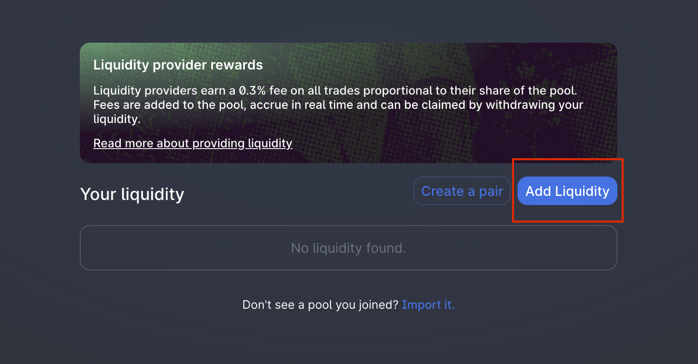

# Liquidity Staking Guide

## Why liquidity staking yields the highest APY

Liquidity staking is a fantastic product that allows users to **earn double rewards** on providing liquidity to the Uniswap BNF-ETH pair. As a liquidity provider \(LP\), users receive higher staking APY **and** a share of the 0.3% pool fee, distributed pro-rata to all LPs for every trade.

It is the ultimate way to earn passive rewards because users will receive high BNF APY rewards and additional BNF and ETH as part of the pool reward. Liquidity staking provides double incentivizes to LPs as they earn double rewards passively.

## Before you begin


Disclaimer: Use Smart Contracts at your own Risk 


As part of BonFi's comprehensive offering, the platform offers **audited liquidity staking** as part of the Native DeFi Products. This offering is accessible to all users of the BonFi Platform. However, to unlock all features, users must stake a minimum of 2500 BNF in either the Rookie or Professional staking pools. 

## **What you need**

* ERC-20 wallet 
* ETH \(used for gas fees\)
* ERC-20 token assets \(i.e. BNF\)
* LP token \(i.e. BNF-ETH pair UNI-V2\) 
* MetaMask widget or WalletConnect app


Ensure your wallet holding your ERC-20 assets has a sufficient ETH balance to cover gas fees



**UNI-V2 tokens are not the same as UNI governance tokens. Each Uniswap pool has a dedicated UNI-V2 token that is associated with the relevant trading pair \(e.g. BNF-ETH\)**

**Follow the guide to access the correct UNI-V2 tokens for the BNF-ETH trading pair**


## **How to become an LP \(Liquidity provider\)** 


Skip steps 1-3 by using the direct link:

[https://app.uniswap.org/\#/add/ETH/0x1DE5e000C41C8d35b9f1f4985C23988f05831057](https://app.uniswap.org/#/add/ETH/0x1DE5e000C41C8d35b9f1f4985C23988f05831057)


**Step 1:** Go to app.uniswap.org and click _Pool_. 

**Step 2:** Click _Add Liquidity_ to access the Uniswap LP portal.

**Step 3:** Enter the [BNF contract address](https://etherscan.io/token/0x1DE5e000C41C8d35b9f1f4985C23988f05831057?a=0x1de5e000c41c8d35b9f1f4985c23988f05831057) in the token search field ****and ensure you've selected the ETH-BNF trading pair. Now input the amount of BNF or ETH, you'd like to supply. Note: LPs are required to provide both BNF and ETH at a 1:1 ratio to the pool.


**BNF contract address: 0x1de5e000c41c8d35b9f1f4985c23988f05831057**



**BEWARE OF FAKE UNISWAP BNF-ETH POOLS. ALWAYS USE THE OFFICIAL CONTRACT ADDRESS!**


**Step 4:** Click on _Supply_ and confirm the details before approving the transaction. Once you're ready to go click on _Confirm Supply_.

**Note:** If the price changes by more than 0.5% your transaction will revert. In order to prevent this, complete this process quickly and use sufficient gas for a fast transaction.

**Step 5:** Follow the instructions in MetaMask and complete the process. Once completed, you are now officially a liquidity provider!

## **How to find UNI V2 tokens in MetaMask**​ 


In order to move your LP tokens **from wallet to wallet or to the staking contract**, users need to add the custom token to the wallet


Step 1: Go back to your MetaMask wallet. Click on _Assets_**.** Scroll down and click ****_Add Token_.

Step 2: Paste the following **Token Contract Address:** [**0xeB8195bd9aC4fFD3Be2056dB1A8e8c66B2708028**](https://etherscan.io/address/0xeB8195bd9aC4fFD3Be2056dB1A8e8c66B2708028) ****and click _Next_.

**Step 3:** Click _Add Token_. Now you will be able to see and manage your LP tokens in your MetaMask wallet. 


**Important:**

**UNI-V2 tokens are ERC20 standard**, which means that they can only be transferred to Ethereum wallet addresses.

**Do not send UNI-V2 tokens to exchanges**. The UNI-V2 tokens are not UNI governance tokens and are not tradable!

**UNI-V2 tokens are your claim to the BNF and ETH** supplied to the liquidity pool. Ensure proper wallet keys management. Losing UNI-V2 tokens may result in losing your BNF and ETH.


## How to stake


**CAUTION: DO NOT DIRECTLY SEND UNI-V2 TOKENS TO THE STAKING CONTRACT, ONLY USE THE PROVIDED USER INTERFACE!**

**ANY TOKEN SENT DIRECTLY WILL BE LOST**


**Step 1:** Navigate to the BonFi platform &gt; DeFi and select the Liquidity Staking pool. Familiarize yourself with the staking terms before proceeding. 

**Step 2:** Enter the amount of UNI-V2 tokens you would like to stake in the pool and click on Approve.

**Step 3:** A pop-up will appear waiting for confirmation. Navigate to MetaMask or WalletConnect to _Confirm_  the spend limit and wait for the transaction to be confirmed while the transaction is being processed.

While waiting, you can either minimize the pop-up or check the transaction status on Etherscan.

**Step 4:** After the transaction was approved a new pop-up will appear highlighting that you are now able to continue the process to stake. Click on _Confirm_ to proceed or _Cancel_ to stop.

**NOTE**: In the event that the pop-up does not appear automatically, manually click _Stake_ a second time and continue with the process \(ensure to select the staking pool, that was selected in Step 1\)

After the transaction is successful, please click on the Confirm button and wait for the transaction to be confirmed.

**Step 5:** A pop-up will appear waiting for confirmation. Navigate to MetaMask or WalletConnect to _Confirm_  the amount of BNF and wait for the transaction to be confirmed while the transaction is being processed.

**Step 6:** After the transaction is completed your BNF tokens are locked in the staking pool until the maturity of the contract. You can track your minimum term, maturity, and earned rewards in the Native DeFi product dashboard.

### **Important**

* **Users can only stake 1 time in each staking pool**
* UNI-V2 tokens will continue to earn pool rewards \(0.3% pro-rated transaction fees\), even after the maturity of the pool
* **Staking requires the users to interact with the staking contract twice**. The first transaction approves the spending limit \(i.e. maximum approved staking amount\), while the second transaction deposits/locks the funds in the staking contract. If a user only interacts with the contract once, funds will remain in their wallet unstaked. To avoid this, users are encouraged to check their balance after staking and/or manually click on _Stake_ to confirm that staking was completed successfully.

