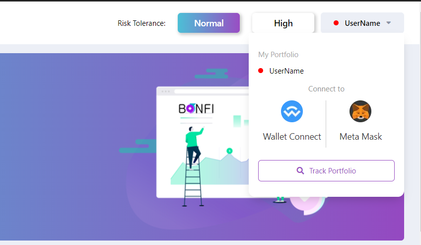

# Connect your Wallet

## **What you need**

* ERC-20 wallet 
* ETH \(used for gas fees\)
* ERC-20 token assets \(e.g. BNF, SFI, VALUE, YFI, etc.\)
* MetaMask widget or WalletConnect app


Ensure your wallet holding your ERC-20 assets has a sufficient ETH balance to pay for gas fees



**The BonFi Platform is fully non-custodial, this means we never ask or request your private keys**


## **How to connect your wallet**

**Step 1:** Click on the _UserName_ button.

**Step 2:** Select and click on your wallet of choice from either _MetaMask_ or _WalletConnect_

**Step 3:** Follow the instructions in the WalletConnect app / MetaMask widget and authorize the connection.

* WalletConnect Support: [https://docs.walletconnect.org/](https://docs.walletconnect.org/)
* MetaMask Support: [https://metamask.io/faqs.html](https://metamask.io/faqs.html)

\*Mobile users are only able to use WalletConnect.

After successfully connecting your wallet, your UserName will be shown as your wallet address.


**Remember your wallet address, because any platform features or native staking offerings are linked to this specific wallet address and do not carry over to a new address**


## **How to create a new account** 

If you would like to create a new UserName or account, simply use an unused ERC-20 wallet address.

