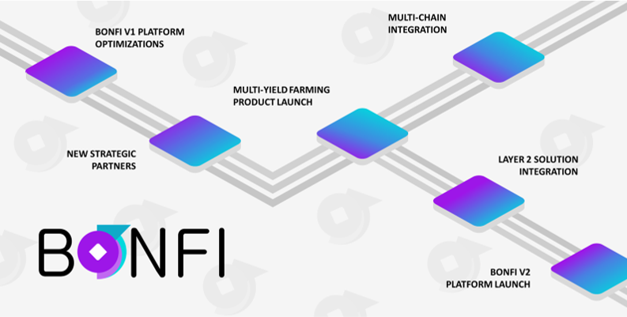

# Whitepaper \(2021\)

## Abstract

Our mission is to bring innovation to Decentralized Finance \(DeFi\) by transitioning to a more beneficial liquidity pool operating model. By launching the BonFi platform, we will enable the crypto community to seize the advantages of Artificial Intelligence, Data Oracles, and Quantitative Analysis to build a more beneficial and decentralized open finance liquidity pool solution. BonFi is supported by the AI-powered BonVest, a liquidity pool service helping users optimize their yield farming portfolios. It expands the DeFi financial product offering using open source technology, decentralized governance, smart contract staking, and data oracles to optimize liquidity pool mining. The BNF governance token functions as an entry piece for the community to become members of the BonFi ecosystem. It concurrently functions as a gateway to directly influence the future direction of the organization. 

## 1. Mission & Vision

### 1.1 Mission

Innovating Decentralized Finance \(DeFi\) - Transitioning to a universally more beneficial liquidity pool operating model.

### 1.2 Vision

We enable the crypto community to seize the advantages of Artificial Intelligence, Data Oracles, and Quantitative Analysis to optimize their liquidity mining pool strategies. Our system streamlines the DeFi value proposition and popularizes the use of digital assets. Ultimately, we aim to be the go-to platform for users looking for a decentralized liquidity mining solution. Our ambition is to provide high utility, balancing risk and reward using sophisticated AI solutions.

## 2. Objectives

The overall goal is to build a distributed ledger-based liquidity mining solution that streamlines the user experience. Moreover, to harness the power of advanced tools and eliminate the need for intermediaries. We have set out to achieve the following objectives:

<table>
  <thead>
    <tr>
      <th style="text-align:left">Factor</th>
      <th style="text-align:left">DeFi Status Quo</th>
      <th style="text-align:left">BonFi Objectives</th>
    </tr>
  </thead>
  <tbody>
    <tr>
      <td style="text-align:left">Artificial Intelligence Advantages</td>
      <td style="text-align:left">Funds are managed by a Robo-advisor or by basic trading bots, which do
        not showcase all opportunities and are high risk.</td>
      <td style="text-align:left">Integration of AI technology is necessary to optimize liquidity mining
        strategies for users.</td>
    </tr>
    <tr>
      <td style="text-align:left">
        
Portfolio

        
Optimization

      </td>
      <td style="text-align:left">Portfolios are constructed using simple metrics. For instance: cryptocurrencies
        with high market value or high-risk digital assets.</td>
      <td style="text-align:left">To allocate crypto assets efficiently, we have to create an optimal liquidity
        pool service that balances and considers risks and staking rewards.</td>
    </tr>
    <tr>
      <td style="text-align:left">Trust-based Governance Model</td>
      <td style="text-align:left">Most DeFi projects rely entirely on trusted financial intermediaries.</td>
      <td
      style="text-align:left">A decentralized governance model requires an ecosystem that incentivizes
        its participants to manage the platform in collective interests.</td>
    </tr>
    <tr>
      <td style="text-align:left">Digital Asset Protection</td>
      <td style="text-align:left">Most DeFi projects do not have sufficient digital asset protection mechanisms
        and are not transparent about user assets&apos; storage.</td>
      <td style="text-align:left">As a non-custodial platform, users are always in control of their tokens
        and private keys, eliminating third-party risk.</td>
    </tr>
    <tr>
      <td style="text-align:left">Scalability</td>
      <td style="text-align:left">Restrictive of portfolio changes. While most DeFi solutions provide a
        streamlined experience, it still requires a steep learning curve.</td>
      <td
      style="text-align:left">For a DeFi solution to efficiently accommodate users, it should be readily
        available, easy to use, and easily transferable.</td>
    </tr>
    <tr>
      <td style="text-align:left">Regulatory compliance</td>
      <td style="text-align:left">An increasing number of different countries slowly enact new legislative
        directives for digital currencies.</td>
      <td style="text-align:left">Adhering to global digital currency-specific regulatory frameworks is
        necessary for widespread community adoption in different jurisdictions.</td>
    </tr>
  </tbody>
</table>

## 3. BonFi Platform

### 3.1 The BonFi Platform

BonFi is a multilayered open finance liquidity mining platform complemented by the AI-powered BonVest. This liquidity mining solution aims to help users optimize their liquidity mining strategies. It expands the DeFi financial product offering by combining smart contract staking, quantitative analysis, and sophisticated risk analysis to optimize cross-platform and multilateral DeFi access for users.

* As an open finance liquidity mining platform, BonFi is built on the Ethereum blockchain and uses an ERC-20 token denoted as BonFi \(BNF\) for its governance.
* Users interact directly with either the BonFi Platform or with third-party DeFi Platforms included in the BonVest.
* The BonVest utilizes state-of-the-art technology, utilizing AI, Data Oracles, and Quantitative Analysis to provide users with market information, risk analysis, and multilateral DeFi access.
* Users gain access to the BonVest through smart contract staking assets on the BonFi Platform, using a Tier system. 
* The BonFi Platform is non-custodial, and users are always in control of their token assets and private keys.

### 3.2 BonVest

By harnessing our proprietary AI's and integrating it into the BonVest, users can tap into Data and supplementary feeds and track and extrapolate market indicators to identify potential opportunities. Through the effective use of the AI system, the platform's liquidity placement suggestions will highlight potential benefits for its users. BonVest's proprietary Artificial Intelligence \(AI\) and Quantitative Data Analysis are capable of:

* Leveraging advanced data analytics;
* Evaluating assets and track market trends;
* Gathering market sentiment data;
* Collecting time-series price action data;
* Mapping complex data patterns;
* Utilizing its predictive analytics to optimize liquidity pool mining.

### 3.3 BonVest AI - Deconstructed

The BonVest AI \(BonAI\) is accessing various analysis engines and data feeds in real-time. It combines predictive modeling algorithms to rate, score, and interpret information, which allows for autonomous results.

| **AI Algorithm** |
| :--- |
| Crypto Market Data |
| Technical Indicators \(extensive indicator library\) |
| Behavioral Data \(Sentiment, Network Activity, Market Events\) |
| Predictive Indicators |

Signal generation based on market events, technical trading indicators, and price data. Uses AI Engine for real-time forecasts, which are contextualized with relevant market and technical indicator information. Flexible time-frames \(e.g., from high-frequency to mid-term movements\)

| **Market Risk Evaluation** |
| :--- |
| Macroeconomics Data |
| Behavioral Data \(Risk Sentiment, Market Events\) |
| Crypto Market Data |
| Real-time Risk Assessment and Adjustment Engine |

Evaluation of macro-economics data in combination with behavioral data such as risk sentiment/appetite allows for real-time risk assessment and adjustment.

| Market Intelligence Database |
| :--- |
| Automated Data Mining \(Web Crawlers, API feeds\) |
| Advanced Feature Engineering |
| Intelligent Database Management |

Develop a market intelligence database based on automated data mining, feature engineering, and intelligent database management.

### _3.4 BonFi Tier System_

The BonFi Platform employs two user tiers:

* **Rookie User:** Each user will start their journey as a Rookie User. This user tier gives you access to basic platform features and functions.
* **Professional User:** This user tier gives you full access to all features within our platform.

Users can access all platform features by locking a minimum of 2500 BNF. Users will earn rewards for unlocking the platform and staking their BNF.

## 4. Advantages

The BonFi ecosystem is designed around the concept of open finance. It brings a sophisticated liquidity pool optimization service to the market. Not only does the BonFi ecosystem provide new products for users to stake digital assets, but it also leads the way for the next iteration of Decentralized Finance: DeFi 2.0_**.**_

### 4.1 Governance

BonFi is supposed to be managed by a decentralized community of BNF token holders. BNF is used to facilitate on-chain governance and to unlock User Tiers that unlock full BonFi Platform access.

<table>
  <thead>
    <tr>
      <th style="text-align:left"><em><b>Purpose</b></em>
      </th>
    </tr>
  </thead>
  <tbody>
    <tr>
      <td style="text-align:left">
        <ul>
          <li>Ability to build a global community</li>
          <li>Expand service scale through community governance</li>
          <li>Accessing the DAO and community voting system, governing the future direction
            of BonFi</li>
          <li>Creating accountability, ensuring that the ecosystem effectively serves
            the needs of collective platform users</li>
        </ul>
      </td>
    </tr>
  </tbody>
</table>

<table>
  <thead>
    <tr>
      <th style="text-align:left">Benefits</th>
    </tr>
  </thead>
  <tbody>
    <tr>
      <td style="text-align:left">
        <ul>
          <li>Uses the robustness of the Ethereum Blockchain</li>
          <li>ERC-20 based snapshot governance allows for cost-effective participation
            and open access</li>
        </ul>
      </td>
    </tr>
  </tbody>
</table>

### 4.2 BonVest

As part of the BonFi Platform, BonVest helps users optimize liquidity mining pool strategies. It provides a new and sophisticated service offering to the broader DeFi market.

<table>
  <thead>
    <tr>
      <th style="text-align:left"><em><b>Purpose</b></em>
      </th>
    </tr>
  </thead>
  <tbody>
    <tr>
      <td style="text-align:left">
        <ul>
          <li>Creating a comprehensive multilayer open finance liquidity mining platform</li>
          <li>Providing access to stake a wide variety of digital assets for staking
            rewards</li>
          <li>Leveraging the benefits of AI and Multi-Variant Data Analytics</li>
          <li>Creating coherent data clusters to drive value</li>
          <li>Assisting in developing staking reward market strategies for users</li>
        </ul>
      </td>
    </tr>
  </tbody>
</table>

<table>
  <thead>
    <tr>
      <th style="text-align:left">Benefits</th>
    </tr>
  </thead>
  <tbody>
    <tr>
      <td style="text-align:left">
        <ul>
          <li>Intelligent algorithms and proprietary technology</li>
          <li>Digital Asset Security (i.e., <em>non-custodial</em>)</li>
          <li>User privileged access management</li>
          <li>Active quantitative and qualitative data management to obtain real-time
            market intelligence</li>
          <li>Risk mitigation by adopting a data-driven approach based on predictive
            market data</li>
        </ul>
      </td>
    </tr>
  </tbody>
</table>

## 5. BonFi DAO

### 5.1 Context

Across the finance and blockchain industries, many organizations face challenges concerning effective governance. Ineffective governance leads to a centralization of power, lack of innovation, or misalignment of stakeholder interests. Examples of non-effective governance include:

* Finance Industry: Stagnant innovation and old ways of managing wealth. Leadership has limited accountability and is disconnected from investors.
* Blockchain Industry: Very challenging to implement protocol updates as it is challenging to reach consensus via the blockchain.

Many public blockchains struggle with power centralization and stakeholder misalignment. These issues prevent them from achieving organizational effectiveness and community involvement. Instead, we want to build a blockchain organization where the community leads the future governance concerning liquidity mining. In such a system, BonFi platform participants, developers, and token holders become an inseparable part of this organization.

The solution lies with transitioning to a Decentralized Autonomous Organization \(DAO\) that moves from off-chain to on-chain decision making. This management structure allows organizations to advance dynamically and drive the adoption of decentralized governance models forward. Simultaneously, it opens new governance channels and streamlining innovation to be considered by the entire organization democratically. Given the benefits of transitioning to a DAO governance model, BonFi, at its inception, will function as a centralized entity but will slowly convert into a DAO with the release of BonFi 2.0. Placing on-chain governance in the hands of token holders will strengthen the core BonFi offering and ecosystem.

### 5.2 BonFi DAO

The BonFi DAO places governance, voting rights, and the organization's election into the community's hands. The governance structure will provide organizational control to a democratically chosen supervisory council and the community, who will have greater control of the future direction of the BonFi ecosystem. Users can directly influence vital organizational decisions, such as the launch of new yield farming products, proposed protocol changes, and more. Ultimately, this model allows the community to continue to seize the opportunities created by BonFi while making governance more democratic. 

### 5.2.1 DAO Governance Model

The BonFi DAO Governance Model of community oversight is an executive body that governs the BonFi Platform. The BonVest is an ecosystem partner and takes part in the DAO governance body's interests \(community/token holders\).

BonFi Community DAO will have the scope to drive vital organizational decisions, including but not limited to, the following:

| Token Governance | Ecosystem Governance | DAO Governance |
| :--- | :--- | :--- |
| BonFi token inflation structure | Community proposal management | BNF Token Expenditures |
| BonFi token reward structure | Voting within the BonFi ecosystem | Upgrades to the BonFi Platform |
| BonFi token utility | Ecosystem grants | Full ownership of BNF token |

### 5.2.2 BonFi DAO Council

The BonFi DAO Council will be composed, at minimum, of five council members. The council members' responsibilities are to take a leading role in guiding the execution of BonFi DAO.

With the go-live of the BonFi DAO, an election will be held to assign Council members. Electoral requirements will include: 1\) a vested interest in the platform through staking of BNF token and 2\) community voting. 1 BNF Token is equal to 1 Vote.

The Council will always maintain an off number of councilors, with a maximum of _**5**_ and a minimum of _**3**_ Council members. The elected Council members will guide the proposal process, voting, and evaluation within the governance model. Council members will have the right to veto any decision that they deem harmful to the DAO's integrity and stability. All decisions require a Council majority vote to pass. Furthermore, within the governance model, it is possible to create sub-councils that focus on relevant topics, such as marketing or community initiatives. The Council and sub-councils are independent of the BonVest and provide checks and balances between community governance and oversight.

## 6. Tokenomics

### 6.1 BNF Token

The BonFi governance token \(BNF\) functions as an entry piece for the community to become members of the BonFi ecosystem. It offers access and unlocks the BonFi Platform. Also, it serves as a gateway to directly influence the future direction of the DAO. Members can influence BonFi’s future governance, the launch of new products, and platform upgrades. As the number of participants grows, the more decentralized and autonomous BonFi becomes. The community can co-govern and expand the token economy of the BNF Token.

### 6.2 Token Utility

The success of BonFi is contingent on the utility that it provides to its users. The following overview delineates the key components that drive the value of the BNF Token:

| **BonFi Platform** |
| :--- |
| **One-stop platform:** The BonFi Platform is non-custodial and allows users to leverage the unique advantages offered by the BonVest and its multilateral DeFi access. Users stake the BNF token to unlock access to the entire platform. |

| **BonVest** |
| :--- |
| **Market insights:** _****_BNF token holders stake 2500 BNF tokens unlock the BonFi Platform fully and, as a result, gain exclusive insights relating to the BonVest and all its features. |

| **BonFi DAO** |
| :--- |
| **DAO Governance:** BNF token holders can vote and influence proposals brought forward by the community governance council and drive critical organizational decisions impacting the platform's future development direction. |

### 6.3 Token Supply & Distribution

The total supply of BonFi \(BNF\) tokens at launch are 1.000.000.000 Tokens. The token supply is fixed for the first two years and will not be changed. After that, the BonFi DAO will reconsider the supply with a maximum inflation cap of 6%.

The current max. and circulating token supply \(incl. burned supply\) can be found here: [Coingecko ](https://www.coingecko.com/en/coins/bonfi)

#### BonFi Ecosystem Expansion

We intend to increase our ecosystem’s value by establishing strong industry partnerships. Besides marketing the BonFi platform, we will also have a grant available to support innovative and strategic projects that augment the ecosystem. Eligible projects include those that increase BNF token’s adoption and utility. Grants are provided to self-operating teams and have a proven ability to execute upon a clear strategy and roadmap. Accordingly, the BonFi Governance team will extend grants on a milestones basis with individuals fulfilling pre-determined KPIs.

#### Team Token Lock-Up Period

The BonFi team and advisors’ BNF tokens are gradually unlocked over a 24-month \(2-year\) timeline, with each release scheduled every three months. The quarterly dispersion of team and advisor tokens amounts to ~12.5% of team allocation or 1.875% of the total supply \(18.75m BNF\).

A total of 37.5 million Team & Advisor BNF tokens are burned to foster the BonFi Platform's growth.

## 7. Technical Roadmap \(Q2-Q4, 2021\)

With the technical roadmap for Q2-Q4, 2021 defined, we will improve and make further additions to the BonFi ecosystem. 

1. **Keep optimizing BonFi V1 Platform:** Post-launch, we will continue to polish the core functionalities of the BonFi Platform. We will keep updating our data libraries, optimize our risk prediction algorithms, and expand our social sentiment trackers.
2. **Integrate additional strategic partners:** Our goal is to expand our ecosystem by partnering with other players in the DeFi industry. These partnerships will focus on new product development and integrating third-party products onto our platform.
3. **Launch of new Multi-Yield Farms:** We will broaden our native DeFi product offering by launching innovative multi-yield yield farms. Our multi-yield yield farms cover the needs and risk appetites of different users. For members seeking a higher reward potential, we will launch joint product initiatives with partners. For those seeking a stable return with lower rewards ceiling, we will present alternatives.
4. **Implement Layer 2 solution:** We are great fans of Ethereum and intend to continue using this protocol. However, the last weeks did reveal that Ethereum experiences challenges concerning scaling. Therefore, we will seek to integrate Layer 2 solutions. Layer 2 is a set of technologies or systems that run on top of Ethereum \(Layer 1\). This additional layer will improve transaction processing capacity, lower transaction fees, and ensure faster transaction confirmation time.
5. **Multi-chain Integration:** We do not believe in the ethos of “_One Chain To Rule Them All_’. Instead, we are supporters of the multi-chain approach advocated by projects such as Cosmos and Polkadot. Our goal is to build multiple bridges to connect different networks. Therefore, we partnered with NERVE Network to gain full access to blockchain protocols such as the Binance Smart Chain \(BSC\) and Huobi Chain. We will look to further spread our presence beyond the Ethereum network towards other ubiquitous chains.
6. **Launch of BonFi V2 Platform:** The launch of BonFi V2 will usher in deep community involvement. We will launch a new governance portal that allows community members to be deeply involved in the BonFi platform’s future direction. Alongside this portal, we will offer new tools to boost community participation and discussions.

